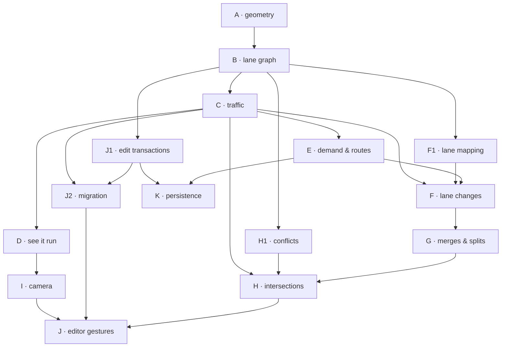

# Implementation backlog: road-building sandbox

Companion to [creativity_plan.md](creativity_plan.md). That document is the design
conversation - what we want, what was confirmed, what is still open. This one is
the build order: the same work cut into cards that one model can pick up cold,
finish, and hand back without holding the rest of the design in its head.

Nothing here overrides the decision register in the plan. Where the plan left a
question open and the answer blocks code, this file adopts a **working default**
and says so. Changing a default means editing this file, not arguing with a card.

## How to use a card

Each card is sized for one session: roughly one new file plus one spec, or an
edit to two or three existing files. A card names what it comes after, what it
touches, what to build, and how to know it is finished.

**The standing check, implied by every card's "Done when":**

    sbt test        # still exactly 6 failures, same 6 names as a clean checkout

Six tests fail on `master` before any of this work starts - five in
`SquantsJsonSpec`, one in `PilotedVehicleSpec`. See CLAUDE.md. Six and green is
the baseline; a seventh failure or a new name in the list belongs to the card
you are on.

**Cards that change what the page draws** are not done until the built JS ships
with them:

    sbt fullLinkJS
    git add -f target/scala-2.13/traffic-opt/main.js target/scala-2.13/traffic-opt/main.js.map

Cards in phases A, B, C, E, F, G and H are pure Scala with no rendering, so they
do not need this. Cards in D, I, J and K do.

**A card is finished when it is committed and pushed.** Not when the code is
written. Phase-closing cards marked **Gate** are worth a look at the running
page before pushing.

## Why this order

The plan's own checklist puts mobile-readability prototyping (its section 1)
before connected traffic (its section 2). This backlog inverts that, for one
reason: a touch prototype of road-building needs something underneath it to
build *into*, and every gesture question - does the preview latch, did the merge
fit, how many cars did that edit cost - is answerable only against a real lane
graph. Building the graph first turns interaction questions into experiments
instead of mockups.

So the spine is:

```
A  geometry            arcs, tangents, extents
B  lane graph          sections, movements, validation      <- the fundamental piece
C  traffic on it       leaders across seams, one tick
D  see it run          a network on screen, moving          <- first visible payoff
E  demand & routes     sources, sinks, destinations
F  lane changes        adjacency intervals, MOBIL, mandatory
G  merges & splits     ramps, lane drops                    <- plan's merge laboratory
H  intersections       stop/yield, conflicts
I  camera              persistent view, follow, overview
J  editor              growth gesture, contact, live migration
K  persistence         save/load, measurement, profiling
```

Phases A through C are the load-bearing ones. Everything after them is additive:
routing, lane changes, merges and intersections each add behaviour to a graph
that already ticks, and the editor rewrites a graph that already runs. If a
phase after D slips, what exists still works.

**D is deliberately early.** It is not on the critical path for E through H, and
it costs about three cards. It buys a running network on the page before any of
the interesting traffic behaviour lands, which is what makes the rest debuggable.

## The three layers, and which one is fundamental

The plan describes editable pieces, a lane graph, and runtime traffic. Of those
the **lane graph is the primary model**, and this backlog builds it first and
directly. The piece/port layer arrives in phase J as a *compiler* onto the graph:
a piece is something that produces sections and movements, not something the
simulation knows about. Runtime traffic never sees a piece.

That ordering matters for a card-sized workflow. A lane graph can be hand-built
in a test fixture in ten lines; a piece catalog cannot. Every card in C through H
tests against hand-built graphs, so none of them wait on the editor.

## Working defaults adopted here

These are proposals in the plan that this backlog treats as settled so cards are
not blocked. Each names the phase it affects. Change any of them by editing this
section; the card text points here rather than restating them.

| # | Question (plan) | Working default | Affects |
| --- | --- | --- | --- |
| W1 | Grid placement or free? | No grid. Ports are the only connection authority; guides are a later overlay | J |
| W2 | Fixed piece sizes or stretchable? | Parameterized: lengths and radii continuous within stated bounds | A, J |
| W3 | Default merge behaviour | Gap acceptance with mainline priority. Zipper is a switchable alternative, not the default | G |
| W4 | Two-way roads in the first kit? | No. Every section is one-way; a two-way road is two sections side by side. Right-hand traffic | B |
| W5 | Must Run resolve every port? | No. Simulate connected components. A dangling outgoing end is an implicit sink and counts its departures separately | C, E |
| W6 | Demand shape | Poisson arrivals at a configured mean rate, seeded | E |
| W7 | Target device and budget | 360 CSS px portrait; 60 sections, 300 vehicles, 16 ms frame budget | I, K |
| W8 | Simulation timestep | Fixed 0.1 s, with an elapsed-time accumulator and at most 5 catch-up steps per frame | C, I |
| W9 | Overview car detail | Markers, not car bodies, below roughly 0.5 px per metre | I |

## Not in this backlog

Deliberately absent, with the phase they would attach to if they come back:

- Multitouch shaping shortcuts (J, after J5 is comfortable) - the plan defers these itself.
- The constrained reshaping solver that moves a whole connected region to make a
  join fit (J9 is a spike, not an implementation). This is the single least
  card-shaped item in the plan: it is a research problem, and it is the one place
  where a model working from a card will produce something plausible and wrong.
- Traffic signals, roundabouts, pedestrians, bicycles, parked cars (phase L, unscoped).
- Import/export of standard network formats.
- Saving user-defined assemblies as reusable pieces.
- Congestion-aware rerouting (needs a stabilization threshold; E3 plans once and keeps it).

---

# Phase A · Geometry

Pure additions to `physics/`. No simulation, no rendering. `Path` already has the
right shape - arc length in, point/heading/normal out - so this phase is about
having enough kinds of `Path` to describe a road that bends, and enough
construction helpers to grow one from an existing end.

### A1 · `ArcPath`, a finite circular arc

**After:** nothing
**Touches:** `physics/Path.scala`, new `test/.../ArcPathSpec.scala`

Add `final case class ArcPath(center, radius: Length, startAngle: Double, sweep: Double)`
next to `RingPath` in the same file. Signed `sweep` in radians carries direction:
positive is counter-clockwise, negative clockwise. `totalLength = radius * |sweep|`,
`isClosed = false`, `normalize` clamps to `[0, totalLength]` the way `StraightPath`
does, `forwardGap(from, to) = to - from`.

`headingAt` must agree with `RingPath` on a counter-clockwise arc, and `normalAt`
is always the left of travel - which points at the centre when sweeping
counter-clockwise and away from it when sweeping clockwise. Getting that sign
backwards puts lane-change offsets on the wrong side of a bend and is not visible
until phase F, so test it here.

`extent` is the bounding box of the *swept* arc, not of the whole circle: take the
two endpoints, then include each of the four cardinal points (0, pi/2, pi, 3pi/2)
that actually falls inside the swept range.

**Done when:** `ArcPathSpec` covers a quarter-turn CCW arc against hand-computed
points, the same arc swept clockwise, the normal's side in both directions, and
an extent that excludes the half of the circle the arc does not reach.

**Do not:** touch `RingPath`. It stays as it is; it is not a special case of this.

### A2 · Growing geometry from an existing end

**After:** A1
**Touches:** new `physics/PathGrowth.scala`, new `test/.../PathGrowthSpec.scala`

Two constructors, which are the only two shapes the endpoint-growth gesture in
phase J ever produces:

    def straightFrom(start: QuantityVector[Distance], heading: DoubleVector, length: Length): StraightPath
    def arcFrom(start: QuantityVector[Distance], heading: DoubleVector, radius: Length, sweep: Double): ArcPath

and the inverse a caller needs to chain them:

    def endPoint(path: Path): QuantityVector[Distance]     // path.pointAt(path.totalLength)
    def endHeading(path: Path): DoubleVector

`arcFrom` derives the centre by stepping one radius to the left of travel for a
positive sweep, to the right for a negative one, and derives `startAngle` from
the centre back to `start`.

**Done when:** a chain of three growths - straight, left arc, straight - is
continuous: each segment's start point equals the previous end point within a
millimetre, and each start heading equals the previous end heading within 1e-9.
That continuity property is what B4 later validates on real connections, so prove
the constructors satisfy it before anything depends on them.

### A3 · Extents that combine

**After:** A1
**Touches:** `physics/Path.scala`, existing `test/.../PathSpec.scala`

`PathExtent` is centre/width/height. Add `def union(other: PathExtent): PathExtent`
and `object PathExtent { def covering(paths: Iterable[Path]): Option[PathExtent] }`.
A network's camera fit (phase I) and its overview map are both this over every
section, so it belongs with the geometry rather than in the scene.

**Done when:** union of two disjoint extents covers both corners exactly; union
with a contained extent is unchanged; `covering(Nil)` is `None`.

---

# Phase B · The lane graph

Pure data and validation, no motion. This is the piece everything else stands on.
Nothing in this phase knows what a vehicle is.

### B1 · Sections and identity

**After:** A1
**Touches:** new `network/Ids.scala`, new `network/LaneSection.scala`, new `test/.../LaneSectionSpec.scala`

Package `com.billding.network`.

    final case class SectionId(value: String) extends AnyVal
    final case class MovementId(value: String) extends AnyVal

    final case class LaneSection(
      id: SectionId,
      path: Path,
      width: Length,
      speedLimit: Velocity,
      layer: Int
    ) { def length: Length = path.totalLength }

IDs are strings rather than generated UUIDs on purpose: a hand-written test
fixture reads better as `SectionId("mainline-0")`, and phase J needs to derive a
child ID from a parent when it splits a section mid-road. `layer` is an integer
level, not a drawing order - two sections whose plan views overlap on different
layers have no relationship at all.

**Done when:** a section built on each of `StraightPath`, `ArcPath` and a
`RingPath` reports the path's length, and `SectionId` equality works as a value.

**Do not:** add vehicles, occupancy, or any mutable field.

### B2 · Movements and the network container

**After:** B1
**Touches:** new `network/Movement.scala`, new `network/RoadNetwork.scala`, new `test/.../RoadNetworkSpec.scala`

    sealed trait MovementKind        // Continuation, Merge, Diverge, Turn
    sealed trait Control             // Uncontrolled, Stop, Yield

    final case class Movement(id: MovementId, from: SectionId, to: SectionId,
                              kind: MovementKind, control: Control)

    final case class RoadNetwork(sections: Map[SectionId, LaneSection], movements: List[Movement])

A movement is the permission to continue from the end of one section into the
start of another. A seam between two straight pieces of the same road is an
`Uncontrolled` `Continuation` - the plan is explicit that road seams must not add
stops, and the type system should make that the boring default.

Give `RoadNetwork` only the obvious accessors: `section(id): Option[LaneSection]`,
`movementsFrom(id)`, `movementsInto(id)`. Do not optimise them yet; B3 does that.

**Done when:** a two-section network with one continuation answers all three
accessors, and a Y-split answers `movementsFrom` with two movements in a stable
declared order.

### B3 · `NetworkIndex`, the precomputed adjacency

**After:** B2
**Touches:** new `network/NetworkIndex.scala`, new `test/.../NetworkIndexSpec.scala`

    final case class NetworkIndex(network: RoadNetwork) {
      val outgoing: Map[SectionId, List[Movement]]
      val incoming: Map[SectionId, List[Movement]]
      def successors(id: SectionId): List[SectionId]
      def predecessors(id: SectionId): List[SectionId]
    }

Built once per network version and carried alongside it. C2's leader lookup walks
this on every vehicle on every tick, so a linear scan of `movements` there would
make the tick quadratic in network size.

**Done when:** index of a Y-split and a merge is correct in both directions, and
a section with no outgoing movement returns `Nil` rather than throwing.

### B4 · Connection validation

**After:** B2, A2
**Touches:** new `network/NetworkValidation.scala`, new `test/.../NetworkValidationSpec.scala`

    sealed trait NetworkFault           // with a human-readable message
    def faults(network: RoadNetwork): List[NetworkFault]

Check each movement for: position continuity (the `from` section's end point is
within a tolerance of the `to` section's start point), tangent continuity (end
heading matches start heading within a tolerance), matching `layer`, and
compatible width. A movement between different layers is a fault - the plan
requires an explicit transition piece, and this is the check that enforces it.

Tolerances are constants in one object with a comment saying why: position 0.05 m,
heading 0.02 rad. Tight enough that a real misalignment is caught, loose enough
that arc arithmetic does not trip it.

**Done when:** a valid chain has no faults; a gap of 1 m, a heading kink of
0.5 rad, and a cross-layer movement each produce exactly one fault naming the
offending `MovementId`.

**Do not:** try to *fix* anything. This reports; phase J decides what to do.

### B5 · Lane adjacency as explicit intervals

**After:** B2
**Touches:** `network/RoadNetwork.scala`, new `test/.../LaneAdjacencySpec.scala`

    sealed trait Side                                     // LeftOf, RightOf
    final case class LaneNeighbour(
      section: SectionId, neighbour: SectionId, side: Side,
      fromS: Length, toS: Length,                         // interval on `section`
      offset: Length                                      // neighbourS = s + offset
    )

added to `RoadNetwork` as a third list. This is the piece the plan calls out as
the thing `TrackRoad` cannot express: it currently maps lanes by normalized
whole-lane progress, which is wrong the moment two adjacent lanes have different
lengths - exactly what an acceleration lane is.

The interval says *where along this section* the neighbour is reachable; the
offset maps a position on one to a position on the other. A ramp is adjacent to
the mainline only over its acceleration region, and that region is shorter than
either section.

**Done when:** two equal-length parallel sections map positions symmetrically
(mapping there and back is the identity); a short ramp adjacent over a 150 m
window maps correctly inside the window and reports nothing outside it.

### B6 · Fixture builders

**After:** B3, B5
**Touches:** new `test/.../NetworkFixtures.scala`

Test-scope helpers, because every card from C onward hand-builds a network and
none of them should spell out coordinates:

    def straightChain(count: Int, each: Length, lanes: Int = 1): (RoadNetwork, NetworkIndex)
    def ySplit(trunkLength: Length, branchLength: Length): (RoadNetwork, NetworkIndex)
    def rampMerge(mainlineLength: Length, accelLength: Length): (RoadNetwork, NetworkIndex)
    def tJunction(armLength: Length): (RoadNetwork, NetworkIndex)

Each builds with `PathGrowth` so it is continuous by construction, and each
asserts `NetworkValidation.faults` is empty before returning - a broken fixture
that fails a later card's test for the wrong reason costs more than this check.

**Done when:** all four build fault-free, and `straightChain(3, Meters(200))`
totals 600 m with two continuation movements.

This card is worth more than it looks. Every later card gets shorter because of it.

---

# Phase C · Traffic on the graph

Headless. No scene, no rendering. Reuses the existing driver equations -
`IntelligentDriverModel`, `PilotedVehicle`, the `reactTo` on `TrackVehicle` - and
replaces only what assumed a single joined lane.

### C1 · Vehicles located on a section

**After:** B3
**Touches:** new `network/NetworkVehicle.scala`, new `network/NetworkTraffic.scala`, new `test/.../NetworkTrafficSpec.scala`

    final case class NetworkVehicle(
      piloted: PilotedVehicle,
      section: SectionId,
      s: Length,
      speed: Velocity,
      lateral: Length = Meters(0),
      acceleration: Acceleration = MetersPerSecondSquared(0),
      next: Option[MovementId] = None,      // chosen continuation; E3 fills it from a route
      route: List[MovementId] = Nil,        // E2 fills it; ignored until then
      destination: Option[SectionId] = None
    )

    final case class NetworkTraffic(bySection: Map[SectionId, List[NetworkVehicle]])

Vehicles in each section's list are ordered leader-first, matching the convention
`TrackLane` and `Lane` already use. Keep `piloted` intact so the driver
parameters, dimensions, UUID, rendering and serialization keep reading the fields
they already read.

`next` exists now, unused, so C2 and C3 can be written and tested before routing
exists. Default it to the first outgoing movement. This is the seam that keeps
phase C independent of phase E.

**Done when:** placing vehicles into a section keeps them ordered leader-first,
`NetworkTraffic.all` returns every vehicle once, and a UUID survives a round trip
through the structure.

### C2 · Leaders across a seam

**After:** C1, B3
**Touches:** new `network/Lookahead.scala`, new `test/.../LookaheadSpec.scala`

    def leaderOf(traffic: NetworkTraffic, index: NetworkIndex,
                 of: NetworkVehicle, within: Length): Option[(NetworkVehicle, Length)]

Returns the next vehicle ahead and the gap to it - bumper to bumper, measured
along the road, not as a straight line. If nothing is ahead in the current
section, follow the vehicle's `next` movement into the successor and keep
looking, accumulating distance, until either a vehicle is found or `within` is
exhausted.

The plan's requirement is the test: *a stopped leader just past a seam is still a
leader*. A vehicle 10 m from the end of its section with a stopped car 5 m into
the next one must see a 15 m gap minus body lengths, not `None`.

Cap the walk by distance, not by section count - the plan notes several short
sections can be crossed in one step. Also cap the number of hops at something
like 20 as a guard against a cycle of zero-length sections.

**Done when:** a leader is found within the same section, one section ahead, and
three short sections ahead; nothing is found beyond `within`; a ring built from
sections does not loop forever; and at a Y-split the vehicle sees only the branch
its `next` points at.

### C3 · One tick

**After:** C2
**Touches:** new `network/NetworkTick.scala`, new `test/.../NetworkTickSpec.scala`

    def advance(traffic: NetworkTraffic, index: NetworkIndex, dt: Time): NetworkTraffic

Three phases, in this order, and the order is the point:

1. **Read.** From one immutable snapshot, compute every vehicle's acceleration
   via `leaderOf` and the existing IDM call. Nothing moves during this phase.
2. **Integrate.** New speed and new `s` for every vehicle, from the snapshot only.
3. **Commit.** Resolve any vehicle whose new `s` exceeds its section length:
   subtract the length, follow `next`, repeat while it still overshoots. Rebuild
   `bySection` ordered leader-first.

Doing it in one pass instead would advance a vehicle twice when it crosses into a
section that iteration has not reached yet. The plan calls this out explicitly and
it is the most likely bug in this phase.

A vehicle that overshoots a section with no outgoing movement has left the
network: remove it and return the departures alongside the new traffic, so W5's
implicit sinks can be counted.

**Done when:** a single vehicle on an empty chain crosses two seams in one tick
and lands at the right total distance; a queue of five vehicles across a seam
keeps its order; every vehicle's `s` advances exactly once per call; and a
vehicle leaving the last section is returned as a departure rather than clamped.

### C4 · Bodies that span a seam

**After:** C3
**Touches:** `network/Lookahead.scala`, `network/NetworkTick.scala`, `test/.../LookaheadSpec.scala`

A vehicle's front crosses a seam before its rear does. Until the rear clears, the
vehicle occupies both sections and a follower in the upstream section must still
see it. Add `def occupiedSpan(v: NetworkVehicle, index: NetworkIndex): List[(SectionId, Length, Length)]`
and make `leaderOf` consult the head section's upstream neighbours for a vehicle
whose rear has not yet cleared.

The plan is firm that this is about the whole body, not the centre point: a gap
computed to a leader's centre is a collision waiting for phase G.

**Done when:** a 4 m vehicle 2 m past a seam is visible to a follower 3 m behind
the seam with a gap of 1 m; once its rear clears, it is no longer reported in the
upstream section.

### C5 · Gate: the seam-invariance property

**After:** C4
**Touches:** new `test/.../SeamInvarianceSpec.scala`

The plan's own gate for this phase: *splitting one physical road into more pieces
does not materially change its traffic behaviour.*

Run identical traffic for 200 ticks on `straightChain(1, Meters(600))` and on
`straightChain(6, Meters(100))`, same seed, same initial positions and speeds.
Compare final cumulative distance per vehicle. They must agree to within a
millimetre per vehicle.

**Done when:** that property holds, and a second case with a stop-and-go wave -
the lead vehicle braking hard at tick 50 - also holds. **This is the card that
says phase C is trustworthy.** If it fails, the bug is in C3's phase ordering or
C2's distance accumulation, not in the test.

---

# Phase D · See it run

The first visible payoff. A network on the page, moving. Three cards.

### D1 · Arcs the canvas can draw

**After:** A1
**Touches:** `svgRendering/RoadShape.scala`, `Window.scala`, new `test/.../RoadArcSpec.scala`

Add `case class RoadArc(center, radius, startAngle, sweep, width) extends RoadShape`
and a `RoadStrip`-style divider variant if lane lines need one. Then teach
`Window` to emit it as an SVG `path` with an `A` command, deriving `large-arc-flag`
from `|sweep| > pi` and `sweep-flag` from the sign.

The projection scales both axes equally for rings already, so an arc drawn with a
single radius is correct - but only while `metersPerPixelAcross == metersPerPixelDown`.
Add an assertion or a comment at the emit site; a network scene must never use the
stretched-axis projection that `StreetScene` allows itself.

**Done when:** the SVG `d` string for a known quarter-turn arc matches expected
flags and endpoints, and both sweep directions render distinguishably on the page.

### D2 · `NetworkScene`

**After:** C3, D1, B6
**Touches:** `traffic/Scene.scala`, `uimodules/Model.scala`, `SerializationFeatures.scala`, new `test/.../NetworkSceneSpec.scala`

`Scene` is a **sealed trait**, so `NetworkScene` must be declared in
`traffic/Scene.scala` itself - putting it in a new file will not compile. Adding
the case also breaks two exhaustive matches, both of which must gain an arm:

- `uimodules/Model.scala:232` - `applyInputTo`. A network scene takes the speed
  control and, later, the demand rate; it has no lanes to disrupt.
- `SerializationFeatures.scala:40` - currently serializes only `StreetScene`;
  leave network serialization to K1 and make the arm an explicit no-op.

Implement the trait: `updateWithSpeedLimit` calls `NetworkTick.advance`,
`renderables` maps each `NetworkVehicle` to a `RenderedVehicle` by placing it on
its section's path (the same `pointAt`/`normalAt` composition `TrackVehicle.placedOn`
uses), `roadShapes` emits one shape per section, `project` fits
`PathExtent.covering` at one scale for both axes, `density` and `sourceTiming`
are `None` for now, `completed` is the departure count.

**Done when:** `NetworkSceneSpec` advances a fixture network ten ticks and finds
vehicle poses on the road; `sbt compile` is clean with no non-exhaustive-match
warnings.

### D3 · Gate: a network on the page

**After:** D2
**Touches:** `SampleSceneCreation.scala`, `Client.scala`, plus the built JS

Build one demo network in `SampleSceneCreation` - straight, broad left bend,
straight, a few cars, a couple of hundred metres - as `NamedScene("network, single road", ...)`,
and add it to the scene list passed to `Model` in `Client.scala:58-71`.

Then follow CLAUDE.md exactly: `sbt fullLinkJS`, `git add -f` both target files,
and confirm with `git show HEAD:target/scala-2.13/traffic-opt/main.js | grep -c NetworkScene`
returning nonzero. Serve over http and watch it - and per CLAUDE.md, take several
screenshots in a row or check `document.visibilityState`, because one shot of a
backgrounded tab is a still photograph, not traffic.

**Done when:** the scene picker offers the network scene, cars drive along it
around the bend, and the built JS in the commit contains it.

---

# Phase E · Demand and routes

Still headless where it can be. Sources put cars on, sinks take them off, and
every car knows where it is going - the plan's D7.

### E1 · Sources and sinks

**After:** C3
**Touches:** new `network/Boundary.scala`, new `test/.../BoundarySpec.scala`

    final case class Source(at: SectionId, meanRate: Frequency, seed: Long,
                            queued: Int, admitted: Int, dropped: Int)
    final case class Sink(at: SectionId, departed: Int)

Poisson arrivals per W6. The important behaviour is what happens when a car
*cannot* be admitted: the plan forbids letting unadmitted demand vanish at a
seam. A source that finds no safe gap at the start of its section holds the car
in `queued` and retries next tick. Bound the queue and count `dropped` past the
bound, so congestion backing up to a boundary is visible as a number rather than
as demand quietly evaporating.

Admission needs a real gap check - the leading vehicle's rear must be far enough
along that a new car at the section start has safe following distance. Reuse
`Lookahead` rather than writing a second notion of gap.

**Done when:** a source at a configured rate admits close to the expected count
over 1000 ticks with a clear road; the same source on a blocked road admits none,
queues to the bound, and counts drops past it; and the same seed replays identically.

### E2 · Routes

**After:** B3, C1
**Touches:** new `network/Routing.scala`, new `test/.../RoutingSpec.scala`

    def planRoute(index: NetworkIndex, from: SectionId, to: SectionId): Option[List[MovementId]]

Dijkstra over movements, weighted by free-flow travel time - section length over
speed limit. Free-flow, not current conditions: the plan defers congestion-aware
rerouting because it oscillates without a stabilization threshold, and this
backlog defers it too.

Plus `def isReachable(index, from, to): Boolean`, which E1 calls before admitting
anything. The plan is explicit: only admit vehicles whose destination is reachable
at spawn, and report unserviceable demand separately instead of spawning cars that
strand.

**Done when:** a Y-split routes to either branch; a route to an unreachable
section is `None`; the shorter-time branch wins when both reach the destination;
and a route through a chain lists every movement in order.

### E3 · Following a route

**After:** E2, C3
**Touches:** `network/NetworkTick.scala`, `network/NetworkVehicle.scala`, `test/.../NetworkTickSpec.scala`

Fill in the `next` field C1 left as a placeholder. On entering a section, a
vehicle sets `next` from the head of its remaining `route` and drops that entry.
Once chosen, the choice is stable - the plan is blunt that repeatedly redrawing a
random branch while queueing produces erratic behaviour, and stability here is
also what makes C2's lookahead meaningful.

A vehicle with an exhausted route at a section with outgoing movements has missed
its exit. The plan's default applies: continue legally, replan from where it
actually is, and never teleport or cut across at the last moment. If the replan
fails, mark it and let it run to whatever sink it reaches.

**Done when:** a vehicle routed to the left branch takes the left branch; its
`next` does not change while it waits in a queue at the split; a vehicle forced
past its exit replans and completes; and a vehicle whose replan fails is counted
as such rather than removed silently.

### E4 · Conservation

**After:** E1, E3
**Touches:** new `network/TrafficAccounts.scala`, new `test/.../ConservationSpec.scala`

One structure holding `requested`, `admitted`, `active`, `departed`, `removedByEdit`
and `dropped`, with `def balances: Boolean` asserting
`admitted == active + departed + removedByEdit` and
`requested == admitted + queued + dropped`.

The plan asks for exactly this and for each vehicle to be accounted once.
`removedByEdit` stays zero until J2 and must never be folded into `departed` -
a car deleted by a geometry edit did not complete a trip.

**Done when:** a 2000-tick run through a congested split balances on every tick;
a deliberately doubled admission is caught by `balances` returning false.

**This card is cheap insurance.** Run `balances` as an assertion inside the test
suites of every later phase; duplication and quiet disappearance are the two
failure modes hardest to see by watching the screen.

---

# Phase F · Lane changes

Reuses `MOBIL` and `LaneChangeIntent` as they stand. Replaces only the
whole-lane-progress assumption in `TrackRoad`.

### F1 · Mapping a position to the neighbouring lane

**After:** B5, C1
**Touches:** new `network/LaneMapping.scala`, new `test/.../LaneMappingSpec.scala`

    def neighbourAt(net: RoadNetwork, section: SectionId, s: Length, side: Side): Option[(SectionId, Length)]

Find the `LaneNeighbour` whose interval contains `s`, apply its offset, return the
neighbour and the mapped position. Outside every interval there is no neighbour,
which is the correct answer for a ramp beyond its acceleration region.

This replaces `TrackRoad.transpose`, which uses normalized whole-lane progress.
Do not call `transpose` from network code; it is right for concentric rings and
wrong for anything whose adjacent lanes differ in length.

**Done when:** mapping inside an interval round-trips; mapping just outside
returns `None`; a ramp adjacent over 150 m of a 400 m mainline maps only within
that window.

### F2 · Discretionary changes

**After:** F1, C3
**Touches:** new `network/NetworkLaneChange.scala`, `network/NetworkTick.scala`, new `test/.../NetworkLaneChangeSpec.scala`

Port the MOBIL decision from `TrackRoad` onto the graph: gather the would-be
leader and follower in the mapped neighbour via `Lookahead`, run the existing
`MOBIL` incentive and safety checks, and animate the change with `lateral` and
`changeCooldown` the way `TrackVehicle` already does.

Run it as its own phase inside `advance`, from the same snapshot and committed
together, for the same reason C3 is staged: a change decided against a
half-updated world is not the change the driver would have made.

**Done when:** a faster driver stuck behind a slow one on a two-lane chain moves
over; the same driver does not move into an occupied gap; the cooldown prevents
immediate dithering back; and C5's seam-invariance property still holds with lane
changes enabled.

### F3 · Mandatory changes

**After:** F2, E3
**Touches:** `network/NetworkLaneChange.scala`, `test/.../NetworkLaneChangeSpec.scala`

A discretionary incentive is not enough for a lane that ends or an exit that must
be reached. Add an urgency term that grows as the remaining distance to the point
where the vehicle *must* be in a given lane shrinks, computed from its route: find
the nearest upcoming movement its current lane cannot make, and measure to it.

The plan's framing is the acceptance criterion: *plan lane preparation early
enough for realistic gaps.* A driver that starts trying 50 m out is not plausible;
one that starts 400 m out and waits patiently is.

**Done when:** a vehicle routed to an exit reaches the exit lane well before the
diverge on a busy road; a vehicle in an ending lane merges out before the taper
rather than at it; and a vehicle with no need to change does not gain urgency.

---

# Phase G · Merges and splits

The plan's merge laboratory. This is where W3 is exercised.

### G1 · Lane drop

**After:** F3, B5
**Touches:** `test/.../NetworkFixtures.scala`, new `test/.../LaneDropSpec.scala`

A lane drop is a taper of nonzero length whose lane ends, with adjacency to the
surviving lane over the taper. The plan insists a lane may not implicitly
disappear, and F3 is what makes this work: the ending lane's vehicles have
mandatory urgency toward the survivor.

Mostly a fixture plus a behaviour test; little new production code beyond
whatever F3's urgency calculation needs to see a lane's end.

**Done when:** at moderate demand every vehicle in the dropped lane merges out
and none is deleted at the taper; at high demand a queue forms upstream and
propagates rather than vanishing; conservation balances throughout.

### G2 · On-ramp merge

**After:** G1
**Touches:** new `network/MergeArbitration.scala`, new `test/.../MergeSpec.scala`

The core of the phase. A ramp adjacent to the mainline over an acceleration
region; ramp drivers seek a gap; mainline has priority (W3).

When two vehicles want the same downstream space in the same tick, the plan
requires a deterministic resolution from a consistent snapshot, committed
together, permitting genuinely safe simultaneous moves. Implement it as: collect
all merge claims, sort by a stable key (mainline before ramp, then by `SectionId`
then descending `s`), accept each claim that still has room given the ones
already accepted, commit the accepted set.

Also add the alternative `Zipper` policy behind the same interface, as a
constructor parameter, so the experiment the plan asks for is a one-line change
rather than a rewrite. Do not make it the default.

**Done when:** moderate ramp demand merges smoothly; heavy demand queues the ramp
without either stopping the mainline dead or letting a ramp car materialise in an
unsafe gap; two simultaneous claims on one gap never both succeed; the same seed
replays identically; and switching to `Zipper` visibly changes the alternation.

### G3 · Off-ramp diverge

**After:** G2
**Touches:** `test/.../NetworkFixtures.scala`, new `test/.../DivergeSpec.scala`

A diverge needs less machinery than a merge - no conflict, just a routed choice
made early (E3) and a lane reached in time (F3). What it does need is queue
spillback: a backed-up exit must block the lane it leaves from, not silently
absorb cars.

**Done when:** routed vehicles take the exit; a blocked exit backs up into the
mainline lane; vehicles not exiting pass unaffected while the exit lane queues.

### G4 · Gate: the merge laboratory

**After:** G3
**Touches:** `SampleSceneCreation.scala`, `Client.scala`, plus the built JS

Build the plan's first experiment as a named scene: two-lane highway, on-ramp,
downstream sink, demand adjustable. Then build its companion, the same layout
with a lane drop instead of an acceleration lane, so the plan's second experiment
- *does primitive composition capture different bottlenecks, or only different
artwork* - can be answered by looking at both.

Ship the built JS.

**Done when:** both scenes run on the page; queues visibly propagate through the
join; no duplication, no unaccounted disappearance, no teleports; conservation
balances.

---

# Phase H · Intersections

Plan D14 and D16. Simple right-angle T-junctions and crossings with stop/yield.

### H1 · Conflicts between movements

**After:** B4
**Touches:** new `network/Conflicts.scala`, new `test/.../ConflictsSpec.scala`

    final case class ConflictPoint(a: MovementId, b: MovementId, sA: Length, sB: Length)
    def conflicts(net: RoadNetwork, junction: Set[MovementId]): List[ConflictPoint]

Two movements through a junction conflict when their traversable curves cross.
Compute the crossing by sampling both curves and finding the nearest approach -
a junction has a handful of movements and this runs at edit time, not per tick,
so sampling is fine and an analytic intersection is not worth it.

The plan separates this from endpoint connectivity deliberately, and so should
the code: a conflict is a property of a pair of movements, not of a section.

**Done when:** a four-way crossing reports the expected conflicting pairs;
two right turns from opposite approaches do not conflict; parallel through
movements do not conflict; a T-junction's cases are correct.

### H2 · Stop and yield admission

**After:** H1, C3
**Touches:** new `network/Admission.scala`, `network/NetworkTick.scala`, new `test/.../AdmissionSpec.scala`

A vehicle approaching a movement with `Stop` must come to a full stop at the line
before it is eligible. One with `Yield` need not stop but may enter only when no
conflicting movement has a vehicle close enough to reach the conflict point first.
Both additionally require downstream clearance: the plan forbids entering a
junction you cannot leave.

A denied movement becomes a stopping constraint far enough upstream to brake
comfortably - feed it into the IDM as a stationary obstacle at the line, not as
an instantaneous stop. And ties need a deterministic rule: nearest to the
conflict point wins, then the stable `SectionId` order.

**Done when:** a stop-controlled vehicle stops fully before proceeding; a
yielding vehicle waits out a stream and then goes; two simultaneous conflicting
arrivals resolve one at a time in a repeatable order; a vehicle does not enter
when the far side is full; and the junction does not deadlock under load from all
approaches.

### H3 · Priority presets

**After:** H2
**Touches:** `network/Admission.scala`, new `network/PriorityPreset.scala`, new `test/.../PriorityPresetSpec.scala`

Named presets - all-way stop, two-way stop with a major road, yield on the minor
approach - each of which assigns `Control` to every movement of a junction. Plan
D16 requires these to be selectable in the connection preview (J6) and to change
*admission decisions*, not just the sign drawn beside the road. Keep them as pure
functions `RoadNetwork => RoadNetwork` so J6 can apply one to a proposed network
and diff the result.

Preserve an explicit per-movement override so a junction can be tuned after the
preset is applied.

**Done when:** applying each preset to the same junction produces different
admission behaviour under identical traffic; an override survives a later preset
application only if it was made after it.

### H4 · Gate: ramp to a T-junction

**After:** H3
**Touches:** `SampleSceneCreation.scala`, `Client.scala`, plus the built JS

The plan's fifth experiment: a highway ramp ending at a neighbourhood T-junction.
Its purpose is to answer whether the architecture extends to priority and
crossing conflicts *without a second traffic engine*. If this card needs a
parallel code path for junction driving, that is the finding, and it belongs in
the plan before phase I starts.

**Done when:** the scene runs; vehicles from the ramp yield, wait, and turn;
mainline traffic is unaffected except by real conflicts; conservation balances.

---

# Phase I · Camera and the phone view

Plan D4 and D6. Until now the scene has refit itself to the viewport every frame,
which is right for a ring and wrong for a network you pan around.

### I1 · A camera that persists

**After:** D2, A3
**Touches:** new `svgRendering/Camera.scala`, `svgRendering/Projection.scala`, new `test/.../CameraSpec.scala`

    final case class Camera(center: QuantityVector[Distance], metersPerPixel: Double) {
      def projection(pixelWidth: Int, pixelHeight: Int): Projection
      def worldAt(screenX: Double, screenY: Double, pixelWidth: Int, pixelHeight: Int): QuantityVector[Distance]
    }

Equal scale on both axes, always. The inverse mapping is what every touch
interaction in phase J needs and what `Projection` has no way to express today.

Camera state lives beside the scene, not inside it - the plan separates editable
network, runtime traffic and viewport state, and a camera that is part of the
scene gets reset every time the scene is replaced.

**Done when:** projecting then unprojecting a world point is the identity within
a pixel at three zoom levels; `fitting` an extent produces a camera whose
projection matches the existing `Projection.fitting` behaviour.

### I2 · Simulation time separated from frame time

**After:** D2
**Touches:** `uimodules/Model.scala`, new `test/.../TimestepSpec.scala`

Today the scene advances once per `requestAnimationFrame`. Per W8, accumulate
elapsed wall time and run whole fixed 0.1 s steps, at most 5 per frame, carrying
the remainder.

The plan's requirement is the test: *rendering fewer frames must not silently
reduce traffic throughput or change merge decisions.* This also matters for
CLAUDE.md's backgrounded-tab problem - a throttled tab should fall behind
visibly, by a bounded amount, rather than by running the simulation slowly.

Render interpolation between steps is optional and can be a follow-up; the fixed
step is not.

**Done when:** the same simulated duration produces the same traffic state
whether stepped in 1 or 20 frame callbacks; a 2-second stall advances at most 5
steps and does not try to catch up 20.

### I3 · Pan and pinch

**After:** I1, I2
**Touches:** `Window.scala`, `uimodules/Model.scala`

Two-finger pan and pinch drive the camera. One finger on the background does
nothing yet - phase J claims it. Keeping camera gestures on two fingers from the
start is what lets J4 take one finger without a conflict, which the plan is
insistent about.

Gesture ownership is decided from the initial touch targets and held for the
duration: adding or removing a finger must not make anything jump.

**Done when:** on a phone at 360 CSS px, a network can be panned and zoomed from
overview to close detail and back without the simulation changing speed or scale.
Ship the built JS.

### I4 · Follow and the overview map

**After:** I3
**Touches:** `svgRendering/Camera.scala`, `Window.scala`, `uimodules/Model.scala`

Plan D6. A follow target - a vehicle, or a congestion hotspot - moves the camera
centre; a small inset shows the whole network with a rectangle marking the main
viewport; a tap on the inset relocates the main view.

Three behaviours the plan specifies and a straightforward implementation misses:
manipulating geometry suspends follow without pausing traffic, and resuming is a
visible action; when a followed vehicle leaves, hold the last location rather than
jumping across the map; and do not auto-switch hotspots while someone is looking
at one.

**Done when:** following a vehicle keeps it on screen through a merge; the inset
rectangle tracks the main view; tapping the inset relocates; a departing followed
vehicle leaves the camera where it was.

### I5 · Level of detail

**After:** I4
**Touches:** `Window.scala`, `traffic/Scene.scala`

Per W9, below roughly 0.5 px/m draw vehicles as markers rather than bodies, and
consider colouring roads by density instead. The plan's constraint is worth
repeating in a comment at the site: **an enlarged marker must not change collision
dimensions.** Display size and physical size are different numbers and the moment
they are the same field, the simulation depends on the zoom level.

Also cull shapes outside the viewport and keep the static road layer retained
rather than rebuilding the whole SVG per frame - `Window` currently replaces
more than it needs to.

**Done when:** the W7 workload (60 sections, 300 vehicles) holds the 16 ms budget
at overview zoom on the target phone, and physical behaviour is identical at
every zoom level.

---

# Phase J · The editor

Everything before this produced a network that runs. This phase lets a finger
change it while it runs. Plan D5, D11, D12, D13, D15.

**Build J1 and J2 before any gesture work.** A transaction API that is correct
and headless is testable; a gesture that edits the graph directly is not, and
the live-migration rules in the plan are too specific to discover through a UI.

### J1 · Edits as validated transactions

**After:** B4, C1
**Touches:** new `network/NetworkEdit.scala`, new `test/.../NetworkEditSpec.scala`

    sealed trait NetworkEdit                 // AddSection, RemoveSection, SplitSection, Connect, Disconnect, SetControl, ReshapeSection
    final case class EditOutcome(network: RoadNetwork, index: NetworkIndex,
                                 faults: List[NetworkFault], migration: MigrationPlan)
    def propose(current: RoadNetwork, traffic: NetworkTraffic, edit: NetworkEdit): EditOutcome

Pure: proposing changes nothing. A proposal with faults is shown, not applied.
A proposal without faults can be applied atomically at a step boundary - the plan
requires that traffic never observe a half-connected network, and a
propose/commit split is how that is guaranteed rather than hoped for.

**Done when:** each edit kind proposes correctly on a fixture; an edit producing a
discontinuity reports the fault and leaves `current` untouched; proposing twice
gives the same outcome.

### J2 · Migrating live vehicles

**After:** J1, C4
**Touches:** new `network/Migration.scala`, new `test/.../MigrationSpec.scala`

    final case class MigrationPlan(moves: List[(UUID, SectionId, Length)], removals: List[UUID])
    def migrate(traffic: NetworkTraffic, plan: MigrationPlan): (NetworkTraffic, Int)

Map each vehicle by its physical position along the original road, preserving
identity, speed, destination and longitudinal order. Where the new geometry has
less storage than the current occupancy needs, retain what fits safely - whole
bodies and real gaps, not centre points - and remove the rest.

Five rules from the plan, all of which are easy to get wrong and each of which
deserves a test:

1. Removals are counted, never hidden. They feed `TrafficAccounts.removedByEdit`.
2. Removals are never counted as completed trips or sink throughput.
3. Repositioning a road is not travel: a migrated vehicle's odometer does not move.
4. Determinism: the same edit against the same traffic removes the same vehicles.
5. Re-run migration against the *latest* tick at commit, not against the tick the
   proposal was computed on. Traffic moved in between. A preview count is an
   estimate and should be labelled as one.

**Done when:** all five hold; an edit to an empty road removes nothing; shortening
an occupied road removes exactly the overflow and keeps the order of survivors.

### J3 · Removal counts on screen

**After:** J2, E4
**Touches:** `uimodules/Model.scala`, `ControlElements.scala`, `Window.scala`

Per-edit feedback ("Road updated · 3 vehicles removed") and a running
"Removed by edits" total, kept separate from the completed-trip tally that
`CompletionTally` already drives. Geometry undo must not decrement the historical
count - a car removed by an edit stays removed from the record even if the edit
is reversed.

**Done when:** a zero-removal edit says so or stays quiet; a costly edit reports
the committed count, not the preview estimate; the completed-trip readout is
unchanged by edits. Ship the built JS.

### J4 · Selecting an endpoint and pulling a road out

**After:** I3, I1, J1
**Touches:** new `editor/Growth.scala`, `Window.scala`, new `test/.../GrowthSpec.scala`

Plan D11 and D12: single finger only. Tap an open end to select it; drag to pull
out a preview; **release leaves the draft in place** rather than committing it.
The geometry is A2's `straightFrom` and `arcFrom` - the drag distance sets length,
the lateral offset sets curvature, and the start heading is inherited so the draft
is continuous with what it grows from by construction.

Keep the pure part - drag position to proposed geometry - in a function that
takes world coordinates and returns a path, so it is testable without a DOM.

**Done when:** the mapping function is unit-tested at several drag positions;
on a phone, a road can be pulled out from an end, released, and still be there;
two-finger camera gestures still work with a draft on screen.

### J5 · Adjusting and committing a draft

**After:** J4
**Touches:** `editor/Growth.scala`, `Window.scala`

A visible handle on the draft's end and its bend, adjustable one finger at a
time. A visible commit and a visible cancel - the plan requires every operation
to have a single-touch control, not only a gesture. Commit runs J1's propose and,
if fault-free, applies with J2's migration.

Keep the handles reachable when zoomed in and near a screen edge; the plan flags
both, and both are easy to miss on a desktop browser.

**Done when:** the full sequence works by touch alone at 360 CSS px - grow,
release, adjust, commit - and cancel leaves the network untouched.

### J6 · Contact and the connection chooser

**After:** J5, H3
**Touches:** new `editor/Contact.scala`, `Window.scala`, new `test/.../ContactSpec.scala`

Plan D13. When a draft touches an existing road, that is a *proposal*, not a
connection: dragging briefly across a road must not modify it. Latch a candidate,
hold it steady rather than switching on small finger movements, and offer the
choice on release: join, intersection, merge, overpass, underpass.

Rank the plausible options from approach angle, layers and lane directions, but
let the choice be explicit. Show small diagrams, not bare icons. For an
intersection, offer H3's priority presets in the chooser and make switching the
preset visibly change the previewed admission behaviour before commit - that is
what D16 asks for.

An option that cannot fit says why, or shows the space it would need. It does not
silently shrink queue storage or manufacture an instantaneous merge to appear to
succeed.

**Done when:** each of the five options previews correctly against a fixture;
the candidate does not flicker under small movements; a pass-over without a dwell
proposes nothing; an impossible option explains itself.

### J7 · Contact insertion

**After:** J6, J2
**Touches:** `network/NetworkEdit.scala`, `network/Migration.scala`, new `test/.../InsertionSpec.scala`

Touching an existing road's *middle* splits it. Cut the affected section at the
junction boundaries, create the new ports and movements, rebuild adjacency and
affected routes, and leave the geometry and lane ordering of unaffected sections
alone.

ID lineage matters: a section split into two keeps a derivable relationship to its
parent, so routes, adjacency and selection can be rebased rather than rebuilt from
nothing. `SectionId` being a string makes this a naming convention - decide it
once, in a comment, and hold it.

And the safety rule the plan states most firmly: **never instantly enable
conflicting traffic through cars already occupying the new junction.** A junction
activated on an occupied road admits nobody until the occupants clear.

**Done when:** splitting an occupied section preserves every vehicle's position
and order across the cut; affected routes are replanned and unaffected ones are
untouched; a junction created under traffic does not admit a conflicting movement
until the area is clear.

### J8 · Undo

**After:** J7
**Touches:** new `editor/EditHistory.scala`, `Window.scala`, new `test/.../EditHistorySpec.scala`

A stack of geometry states. One accepted proposal is one undo step, including
every section it changed. Undo is itself a live network change: it runs through
J1 and J2 like any other edit, which means it *cannot* restore old vehicle
positions - the plan distinguishes geometry undo from replay and so must the
implementation, and the UI should not imply otherwise.

Undo must be prominent. The plan says so twice.

**Done when:** undoing a multi-section reshape restores all of it in one step;
undo does not resurrect removed vehicles or decrement the removal count; redo
works; and undo while traffic runs does not stall the simulation.

### J9 · Spike: fitting by reshaping a region

**After:** J8
**Touches:** a written finding in `creativity_plan.md`; production code only if the spike succeeds

**This is a research card, not an implementation card.** Plan D15 permits the
editor to reshape a larger connected area to make a connection fit, which needs a
constrained geometry solver, not snapping. The plan's own advice is to prototype
it on a few bounded arrangements before promising arbitrary networks.

Timebox it. Try it on exactly three cases: extending a road into a bend that must
widen, attaching a ramp that needs the mainline to shift, and closing a loop that
is 5 m short. Report what worked, what the expansion rule should be, and whether
the "show a small number of candidate solutions" approach is tractable.

**Done when:** the finding is written into `creativity_plan.md` with a
recommendation. A negative result is a successful outcome for this card - saying
"not tractable yet, here is what we can do instead" closes it.

---

# Phase K · Persistence, measurement, performance

### K1 · Versioned network documents

**After:** J1
**Touches:** new `network/NetworkJson.scala`, `serialization/BillSquants.scala`, new `test/.../NetworkJsonSpec.scala`

Play-json formats for `RoadNetwork`, sources, sinks, demand settings and seed,
behind a schema version field so an old saved map can be recognised and either
migrated or refused clearly.

Note the baseline: `SquantsJsonSpec` already fails five tests on `master` around
squants round-trips. Do not assume those are yours, and do not fix them as part
of this card unless they block it - if they do, that is a separate commit with
its own message.

Camera and editor selection are saved separately from the network, per the plan's
separation of viewport state. A runtime traffic snapshot is optional.

**Done when:** a network round-trips through JSON with identical geometry,
movements, adjacency and controls; a document with an unknown version is refused
with a clear message; `sbt test` still fails exactly the same 6.

### K2 · Measurements and repeatability

**After:** K1, E4
**Touches:** new `network/Measurements.scala`, `ControlElements.scala`, new `test/.../MeasurementsSpec.scala`

Throughput at a detector, mean travel time, queue lengths, and a scenario reset
that replays identically from the same seed. The plan's closing question - which
measurements matter most - is answered by having a few cheap ones and seeing
which get used.

Two layouts, identical demand and seed, compared side by side is the plan's
stated creative payoff and is nearly free once reset-from-seed works.

**Done when:** the same seed produces byte-identical measurements across two
runs; changing only the layout changes the measurements; reset returns to the
initial state without reloading the page.

### K3 · Profile on the target phone

**After:** I5, G4
**Touches:** findings recorded in `creativity_plan.md`

Run the W7 workload on a real device, not viewport emulation - the plan is
explicit that emulation cannot validate touch comfort or speed. Record frame
times, where they go, and whether the retained-SVG choice holds or Canvas
vehicles over a static SVG road layer are needed.

**Done when:** numbers are recorded against the agreed workload and the renderer
choice is settled with evidence rather than assumption.

---

## Dependency map



The two long poles are `A → B → C` and `D → I → J`. E, F, G and H all hang off C
and can be interleaved; J is the only phase that needs almost everything.

## If you are picking up a card cold

1. Read the card and the one it comes after.
2. Read the design context in `creativity_plan.md` for that phase - the card
   states what to build, the plan states why, and the why is where the
   non-obvious constraints live.
3. Check `sbt test` before you start. Six failures is the baseline; if it is
   already seven, find out whose before adding to it.
4. Build it, with the spec the card names.
5. If the card touches rendering, `sbt fullLinkJS` and `git add -f` the two
   target files. Verify with `git show HEAD:...| grep -c` rather than assuming.
6. Commit and push. Per CLAUDE.md, that is what finished means.
