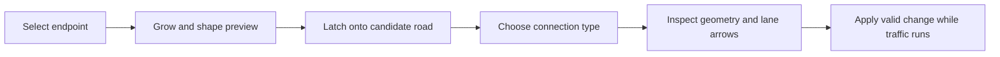
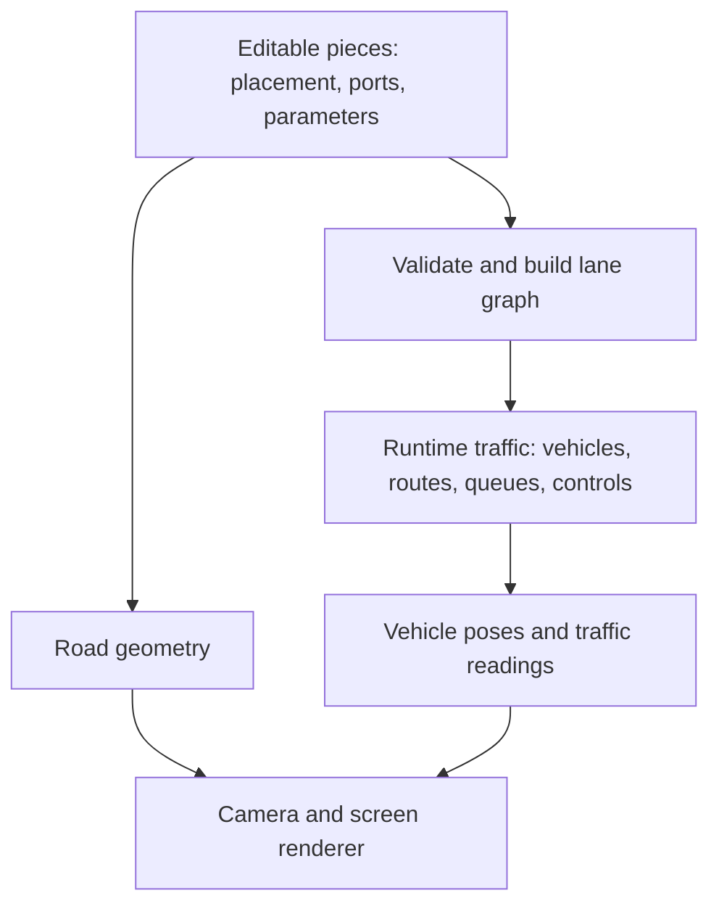

# Road-building sandbox: creativity plan

Status: active design discussion, 2026-09-18. This is a design conversation and
implementation checklist, not approval to implement every proposal below.
Record answers here as they arrive; distinguish requirements, prior decisions,
recommendations, and unresolved choices.

## What we want

- Assemble and rearrange road systems from primitive pieces, like 2D Lego.
- Start with highways, including merges and splits.
- Leave a credible path toward neighborhood streets and intersections.
- Track each piece's connection points, lane directions, and vehicle input/output.
- Keep traffic and controls understandable on approximately five-inch screens.
- Build and watch on phones in the first version (confirmed by the user).
- Prioritize plausible individual drivers and believable congestion when realism
  and ease of experimentation conflict (confirmed by the user).
- Support quick experiments: change a layout or traffic demand and see the result.
- Make creating and arranging roads fun and engaging, not merely possible.
- Keep traffic running during geometry edits and preserve vehicles wherever
  possible (confirmed by the user).
- Comfortably view several highway merges and splits together; allow creators
  to zoom in closely for detailed editing (confirmed by the user). Exact road
  piece counts, vehicle counts and target device remain open.
- Express input/output capacity through lane connections and available space;
  let flow emerge naturally (confirmed by the user).
- Prefer a main view following a vehicle or traffic hotspot, with a small overview
  map for context (confirmed by the user).
- Give each vehicle a destination and a planned route in the first version
  (confirmed by the user).
- Include simple bridge layers in the 2D editor for the first highway maps
  (confirmed by the user).
- Prefer growing roads from endpoints as the main creation interaction (confirmed
  by the user). Explore multitouch shaping and a quick choice of connection type
  when the growing road contacts an existing road: intersection, merge, over/under.

The user requested planning and brainstorming first. No road-model or UI changes
are part of this draft.

## Existing work and the architectural hinge

[TILES.md](TILES.md) contains earlier decisions: grid placement, multiple lane
ports on each side, and tiles that describe geometry rather than owning cars.
It also proposes overlays in free space; that is a related workstream, not an
assumed prerequisite for the new road system. Keep that document intact while
reconciling its decisions here.

Its unresolved question 8 is fundamental: can lanes remain single joined paths,
or must they become a graph? A branch cannot be represented by one unambiguous
path. Prebuilding a separate whole path per route duplicates shared road unless
vehicle occupancy and interactions are still indexed on common lane sections.

Relevant implementation findings:

| Current code | Useful foundation | Change required for networks |
| --- | --- | --- |
| `physics/Path.scala` | Distance along a path; position, heading, normal, bounds | Partial arcs, composite paths, transforms; preserve distance when crossing boundaries instead of clamping it away |
| `traffic/TrackLane.scala` | Individual vehicles, IDM following, ordering along a lane | Find leaders across connected sections; handle a vehicle whose body spans a boundary |
| `traffic/TrackRoad.scala` | MOBIL choices, gap checks, lane-change animations | Explicit adjacent-lane intervals and position mapping; normalized whole-lane progress is insufficient at ramps and lane drops |
| `traffic/Scene.scala` | Common rendering and scene interface | Add a network scene alongside existing street/ring scenes |
| `svgRendering/Projection.scala` | World-to-screen projection and uniform fitting | Persistent camera, inverse mapping for touch, zoom and pan |
| `Window.scala`, `Client.scala` | SVG rendering and reactive controls | General curves; retain static road elements instead of replacing the complete SVG on updates |
| `uimodules/Model.scala` | Scenario controls and state | Separate editable network, runtime traffic, and camera state; decouple simulation advancement from display frames |

Do not make `TrackRoad.update` traverse each tile independently: downstream
queues and competing merges need a view of the connected network.

## Approaches and trade-offs

### How pieces are placed

| Approach | Good at | Costs |
| --- | --- | --- |
| Equal square tiles, fixed lane slots | Easy snapping, rotation, touch placement and validation | Large curves and ramps need many tiles; catalog grows with lane counts and orientations |
| Grid with parameterized pieces spanning several cells | Lego feel plus long tapers, broad bends and reusable interchange assemblies | Footprint/overlap checking and port compatibility are more involved |
| Rigid pieces freely positioned, snapping compatible ports | Less grid restriction; automatic alignment to an existing road | Closing loops and joining two existing branches may require a different piece or moving an assembly |
| Adjustable curves with snapping endpoints | Natural geometry and arbitrary junction angles | Harder touch editing, curve generation, and geometry validation |

**Confirmed interaction:** grow roads from endpoints. **Working recommendation,
awaiting confirmation:** make ports authoritative and offer optional grid/angle
guides without constraining every road. Choosing endpoint growth does not itself
settle grid versus free positioning. Parameterized pieces remain useful underneath
the gesture; people should not need to choose every small section from a palette.
Mirroring must regenerate lane directions and mappings, not just flip the artwork.

### Discussion: which placement system is more fun?

The user explicitly values fun and engagement and has chosen endpoint growth as
the preferred interaction. Grid placement is still open. The comparison below
records the trade-offs behind that discussion, rather than reopening the choice
of endpoint growth. Predictions about usability need testing on a phone.

Three independent choices are easy to confuse:

1. **Position:** on a grid or anywhere in the world.
2. **Shape:** fixed piece, adjustable length/radius, or freely drawn curve.
3. **Connection:** explicit compatible lane endpoints in all cases.

A freely positioned fixed bend cannot necessarily join two already placed ends.
Snapping one end determines its position and orientation; the other end may
still miss. Connecting both ends needs suitable geometry, adjustment of other
pieces, or an explicit generated connector. This is the largest hidden cost of
free placement, particularly when closing loops or completing an interchange.

| Experience | Grid snapping | Free placement with port snapping |
| --- | --- | --- |
| Source of enjoyment | Quick assembly, clear choices, a satisfying construction puzzle | Shaping a place, sweeping curves, more personal-looking layouts |
| First successful road | A small compatible kit can make this very quick | Growing from an existing port can also be quick if rotation aligns automatically |
| Building neighborhoods | Repeated blocks and parallel streets are straightforward | Irregular streets feel natural; parallelism and equal spacing need optional guides |
| Building highways | Predictable modules, but ramps may feel constrained by the grid | Broad bends and oblique ramps are easier to express with adjustable geometry |
| Common frustration | The layout wanted is between cells, or the catalog lacks a fitting piece | A nearly connected join, ambiguous snap target, or a loop that will not close |
| Phone interaction | Coarse cells reduce positioning precision, though a finger can still obscure the preview | Large magnetic targets and alignment previews reduce precision; raw rotate/drag handles would be cumbersome |
| Supporting complexity | Compatible footprints, lane slots and a useful piece catalog | Snap-target selection, rotation, collision checking, and potentially a curve/constraint solver |

Neither placement system by itself solves merges, lane-count mismatches or
intersection conflicts. Both produce the same lane graph. A grid only helps
connections fit when the kit's dimensions and ports were designed to fit it.

**Alternative interaction: assemble pieces.** Choose a straight, bend or ramp;
preview it at a compatible grid location; tap to place; rotate using a button.
Make common pieces adjustable in bounded increments so the fun is not interrupted
by hunting through dozens of nearly identical tiles.

**Preferred interaction: grow from a connection.** Tap an open road end, choose
straight/bend/ramp, and drag or tap the desired extent. The starting end stays
attached and its heading aligns automatically. Nearby compatible ends attract
the preview. Length/radius adjustments create geometry within defined constraints.
This is more guided than placing arbitrary floating pieces. The user is also
interested in multitouch gestures and choosing how a new contact connects.

**Possible combination:** use ports as the connection authority, offer grid and
angle guides for organizing space, and let a compatible port alignment override
a guide. Show a stable preview before committing. Do not switch snap targets
with tiny finger movements; retain the selected target until the user moves away.
Expose a simple way to choose a different nearby target. A combination is useful
only if it feels like one predictable interaction, not two competing snap systems.

The confirmed simulation priority is plausible drivers and believable congestion.
The editor may propose a valid curve or longer taper automatically; it must show
the resulting shape before accepting it. Do not silently shrink physical queue
storage, remove vehicles, or create an instantaneous merge to make a join appear
successful. Curve speeds and acceleration-lane lengths need coherent world units,
even if the displayed cars or selection handles are enlarged for readability.

Prototype endpoint growth with and without grid guides on the same touch tasks:
extend a highway, attach an on-ramp, close a loop, build a block, then change a road
already connected at both ends. Assess time to first working traffic, accidental
edits, undo/correction frequency, and whether the user wants to keep experimenting.
Prototypes can initially use static roads and a preview vehicle; a full simulation
rewrite is not needed to discover which editor interaction feels better.

### Growing roads, gestures and choosing a connection

The desired experience is growing a road and quickly deciding what happens when
it meets another road. Exact gestures and the first intersection's scope are
still open. A proposed sequence:

Contact is a proposal, not a connection. Briefly passing over a road while dragging
must not modify it. Proposed trigger: hold the candidate highlight steady, then
show the chooser when the finger lifts. This leaves the preview in place and puts
the choice above the finger or in a compact sheet near the screen edge. Test this
against a dwell/drag-through chooser; release-to-choose is not yet a user decision.

| Choice | Preview and topology | Conditions to check |
| --- | --- | --- |
| Join an endpoint | Continue into a compatible lane group | Direction, tangent, lane mapping and layer |
| Right-angle intersection | Square up the new approach; show a T-junction when it ends there, or a crossing if it continues beyond | Same level, allowed turns, space for the shape and conflict/right-of-way rules |
| Merge | Curve into the selected traffic direction, with an acceleration or taper region | Mainline direction, target lanes, safe gaps and sufficient approach length |
| Overpass | Continue across on a higher layer without a junction | Clearance footprint and space for explicit layer transitions |
| Underpass | Continue across on a lower layer without a junction | Same checks, including conflicts with any roads already on that layer |

Show small diagrams and labels, not only abstract icons. Rank plausible choices
from approach angle, layers and lane directions, but let the user choose explicitly.
A steep approach can suggest a curved merge; it cannot become an instantaneous
right-angle merge. If a chosen shape does not fit, show the required space or a
reason it is unavailable. Bridge choices must preview the full crossing and layer
transitions rather than ending a road invisibly beneath the existing road.

Touching an existing road's middle needs **contact insertion**: split its affected
lane sections at the new junction/merge boundaries, create explicit ports and
movements, and rebuild affected adjacency and routes. Preserve the geometry and
lane ordering of unaffected sections. Remap vehicles by their physical position
along the original road; preserve speed, destination and identity where feasible.
In-progress lane changes and cars inside a proposed new conflict area require the
live-edit safety policy before activation. Never instantly enable conflicting
traffic through cars already occupying the new junction.

The contact operation may generate a reusable junction/ramp assembly from several
primitives. The gesture describes the intended result; it need not correspond to
exactly one tile. The user should be able to inspect and adjust the generated
result later. Any adjustment to existing roads must be visible in the preview;
how much adjustment to allow is a pending user question.

Multitouch candidates, all provisional:

| Context | Proposed interaction | Alternative / risk |
| --- | --- | --- |
| Selected open endpoint | One finger pulls out the road preview; release leaves it editable | Tap an endpoint and then tap the intended end for more deliberate placement |
| Camera navigation | Two fingers pan/pinch the camera, including while a road preview exists | Making generic pinch resize roads could interfere with required close editing zoom |
| Explicit road shaping handles | A second finger on a visible bend or tangent handle adjusts curvature/heading while the first controls the endpoint | Requires deliberate handle acquisition; test occlusion and comfort on a small phone |
| Candidate contact | Release reveals large connection choices; tapping one previews it | A radial flick may be a later shortcut, but needs forgiving sectors and an equivalent visible action |

Choose gesture ownership from the initial targets and hold it for the gesture;
adding/removing a finger must not make the preview jump or accidentally commit.
Handle gestures and background camera gestures must be distinguishable. Keep the
camera's automatic follow suspended during manipulation while traffic continues.
Provide visible single-touch controls for all operations; gestures should improve
speed without making the editor undiscoverable or unusable with one hand.

Scope question: the user suggested right-angle intersections as a desired contact
choice, but has not yet specified whether their traffic behavior belongs in the
first highway release. Even a simple T-junction needs legal turns, conflict rules
and yielding. If included initially, move that work into the first network slice;
a chooser that draws crossing asphalt without those rules is not a working junction.

### Live edits while traffic keeps running

Confirmed: keep traffic running and preserve vehicles wherever possible. This
rules out resetting the whole simulation as the normal geometry-edit workflow.

Proposed mechanics, still to validate:

- Manipulate a preview while the current network runs. Commit a valid graph and
  its vehicle-state migration together at a simulation-step boundary; traffic
  must never observe a half-connected network.
- Preserve stable lane/vehicle IDs, current traffic and queues on unaffected roads.
  Recompute affected route continuations and adjacency when topology changes.
- Adding an empty branch is the simplest case. Shortening an occupied road,
  changing lane count, or moving a connected endpoint needs an explicit policy
  for cars, rear-body occupancy, in-progress lane changes and insufficient space.
- Candidate policy for disruptive edits: prevent new entry to affected sections,
  let them clear while the rest of the network runs, then apply the change. Show
  that an edit is pending and allow cancellation. Blocked traffic might never
  clear, so this cannot be the only policy.
- Decide alternatives for edits that cannot preserve all cars: reject the edit
  with an explanation, allow explicit removal with accounting, or another user-
  chosen behavior. Do not silently teleport cars into a safe-looking gap.
- Undoing geometry is also a live network change. It cannot restore old vehicle
  positions without rewinding traffic; distinguish geometry undo from replay.

This increases the value of bounded local edits. Grid pieces help constrain an
edit's footprint, but deleting an occupied grid tile still needs migration rules.
With free placement, moving a road can also reshape its neighbors; show exactly
which sections will change rather than silently adjusting a large connected area.
Growing a new branch from an open port is a promising common interaction for both.

### How traffic moves through them

| Approach | Good at | Costs / limits |
| --- | --- | --- |
| Stitch tiles into whole continuous lanes | Smallest change for rings and unbranched roads | Merges/splits still require shared occupancy and route logic; poor network foundation alone |
| Directed lane graph with continuous distance on each section | Individual cars, shared queues, branches, ramps, future intersections | Requires boundary lookahead, transfer arbitration and route-aware lane changes |
| Discrete cells or aggregate queues | Fast experiments with many vehicles; explicit flow/storage accounting | Coarser driving and animation; substantial change to current IDM/MOBIL behavior |
| External simulator, e.g. SUMO | Existing network and intersection behavior; potential calibration/export path | Integration and deployment work; keeping a client-only phone app would need separate investigation |

**Recommendation, awaiting confirmation:** a directed lane graph, reusing the
current driver equations where appropriate. Join simple consecutive geometry
pieces internally if useful, but retain graph branches and stable editor IDs.
Road-piece boundaries need not create artificial driving decisions.

SUMO's network design distinguishes roads, lanes, junction rules and lane
connections. This is a useful precedent for that separation, not a recommendation
to adopt its complete data format or runtime.
[Reference: SUMO road networks](https://sumo.dlr.de/docs/Networks/SUMO_Road_Networks.html).

## Proposed contract for a road piece

Keep three layers distinct:

Suggested vocabulary, not a final Scala API:

- **Piece definition:** parameterized straight, bend, merge, split, etc.; footprint,
  local lane geometry, connection points and allowed movements. Contains no live cars.
- **Piece instance:** stable ID, definition/version, placement, rotation, parameters.
- **Port:** stable ID, boundary side where applicable, local position/offset, travel tangent and
  ordered lane endpoints. Each endpoint has an ID, in/out direction relative to
  the piece, width and elevation layer. A side can have several ports or none.
- **Connection:** explicit mapping from an outgoing lane endpoint to an incoming
  endpoint on another piece. Ports carry lane lists; endpoints identify individual
  lanes, avoiding ambiguous claims that one port is both one lane and many lanes.
- **Lane section:** directed physical path with length, speed profile and allowed
  neighboring lanes over specified intervals.
- **Movement:** permitted continuation from an incoming section to an outgoing
  section, including a real traversable curve where needed. May carry a yield,
  signal or conflict rule. A tile seam can be a simple continuation.
- **Runtime vehicle:** one owner section, longitudinal distance, speed, driver
  state, intended continuation/route and lane-change state. Body occupancy can
  extend into neighboring sections without duplicating the vehicle.
- **Scenario:** network document plus demand sources, destinations, control settings
  and random seed. Camera and editor selection are separate from traffic state.

Connection validation must check position and tangent continuity, direction,
lane correspondence, width compatibility and layer. Opposing boundary normals
face each other; the vehicle's travel tangent remains continuous. A lane-count
change requires an explicit taper/merge/split, not implicit disappearance of a lane.

Snapping proposes connections; validation makes them real. Crossing artwork never
automatically means connected roads. Overpasses need explicit layer separation;
same-level crossings need junction geometry and conflict rules.

Bridge layers are confirmed for the initial kit. Layer belongs to physical lane
connectivity, not merely drawing order. Connections require matching endpoint
layers; changing layers needs an explicit ramp/transition. A piece may have ports
on different layers if its geometry describes that transition. Distinct-layer
crossings have no merge or intersection conflict solely because their plan views
overlap. The first representation can be a 2D drawing with discrete levels; grade
physics and full 3D elevation profiles are not yet scoped.

For touch selection, provide an active layer or a chooser where roads overlap.
Bridge drawing needs readable deck/underpass cues, and a selected route should
remain traceable beneath a bridge. Decide how vehicle follow presents temporary
occlusion; do not mistake invisibility under the deck for a lost vehicle.

Local speed rules and junction controls may be authored on a piece and compiled
into the network. Keeping live vehicles outside pieces does not require pieces
to be restricted to geometry alone. This is a proposed revision of TILES.md's
stronger geometry-only restriction.

## Capacity: four different quantities

Confirmed: the initial road pieces express lane connections and available space,
with throughput emerging naturally. They do not need configurable per-piece flow
caps. Source demand is separate: how many cars try to enter does not guarantee how
many can fit or pass through.

Do not assign a single number called capacity and use it for everything.

| Quantity | Meaning | Example |
| --- | --- | --- |
| Connectivity | Which lanes can accept or send traffic | Two incoming lanes connect to one outgoing lane |
| Storage | How much stopped traffic fits physically | Queue length depends on section length, vehicle lengths and gaps |
| Demand / admission limit | Traffic wanting to enter, or a deliberate metering rule | Source requests 20 vehicles/minute; ramp meter limits admission |
| Observed throughput | Vehicles actually crossing a detector per unit simulation time | Congestion reduces completed departures despite unchanged demand |

Physical throughput emerges from following distances, speeds, merging and
downstream space. Deliberate ramp metering is a possible later traffic-control
feature, not an initial per-piece capacity setting; it would still require safe
admission space. Incoming capacity is shared when
several approaches compete for the same downstream lane.

Unadmitted demand needs an explicit policy: queue outside the modeled network,
discard it and count it, or model the upstream approach. Proposed default: retain
and display a virtual source queue, with a documented bound and overflow policy.
Internal congestion must back up onto upstream roads; it must not vanish at a seam.

## Merges and splits: behavior, not just connectors

A highway on-ramp usually needs an acceleration lane and a region where drivers
seek a gap. A two-to-one lane drop is a different primitive. A Y split must give
drivers enough advance knowledge to reach a permitted exit lane.

Confirmed routing model: each vehicle has a destination and plans a route, rather
than choosing branches by percentages. Destinations initially can be explicit
sinks. Demand needs origin/destination choices as well as an arrival process.
Only admit vehicles with an initially reachable destination; separately report
unserviceable demand instead of repeatedly spawning stranded vehicles.

Proposed routing baseline: choose routes using physical travel-time estimates and
permitted lane movements. A coarse road route is useful only if the driver can
reach its required lanes; plan lane preparation early enough for realistic gaps.
Preserve destination and intended route across ticks. Recheck affected routes
after network edits or missed exits. If no legal route remains, surface that
condition and apply an explicit policy rather than silently changing destination.
Congestion-aware rerouting is a later choice; it needs a switching threshold or
other stabilization so drivers do not oscillate between nearly equal routes.

Proposed first kit:

1. Source and sink boundaries with configurable demand and destinations.
2. One-direction straight with a lane-count parameter; opposing directions can be
   composed into a two-way road assembly later.
3. Broad bend with supported radius and lane count.
4. Lane addition and lane drop with a taper of nonzero length.
5. On-ramp assembly: approach, acceleration lane, merge region.
6. Off-ramp assembly: approach, diverge region, exit branch.
7. Simple bridge/overpass layers and explicit transitions between levels.

Offer convenient ramp pieces in the palette, but allow them to be made from the
same underlying sections and rules. Later, users can save groups as reusable
assemblies with exposed external ports.

Required simulation behavior:

- Look ahead through several downstream sections far enough to brake safely.
  A stopped leader just past a seam is still a leader.
- Carry leftover travel distance across boundaries, including more than one short
  section in a step. Reject zero-length traversable cycles.
- Keep each vehicle's identity and account for its rear clearing a seam/conflict.
- Decide competing merge entries from a consistent snapshot, resolve them in a
  deterministic order, then commit accepted moves together. Permit safe simultaneous
  movements; never advance a vehicle twice because of section iteration order.
- Check downstream receiving space and conflicts before admission. A denied
  movement creates a stopping constraint far enough upstream for braking.
- Treat ordinary continuation differently from yielding: road seams do not add stops.
- Define merge priority and starvation behavior. Compare mainline priority, zipper
  alternation and gap acceptance as explicit experiment choices.
- Choose a split continuation before the last moment. Keep that choice stable;
  repeatedly drawing a random branch while waiting creates erratic behavior.
- Define what happens when a driver misses an exit. Proposed default: continue
  legally and reroute where possible; never teleport or make an unsafe last-second cut.
- Support mandatory lane changes for an ending lane or planned exit, in addition
  to MOBIL's discretionary incentive to change lane.

For future neighborhood intersections, a movement also needs crossing conflicts,
right-of-way and downstream-clearance rules. These are distinct from endpoint
connectivity. SUMO documents this distinction through internal junction links and
intersection behavior.
[Reference: intersections](https://eclipse.dev/sumo/docs/Simulation/Intersections.html).

## Geometry and five-inch screens

**Confirmed viewing goal:** comfortably understand a network containing multiple
highway merges and splits and zoom closely for editing. The preferred phone view
follows a vehicle or traffic hotspot, with a small overview map. These are
complementary: the main view shows readable local traffic while the overview
preserves the larger network context. Exact individual-car detail in the overview
remains open. Arbitrarily large maps cannot show every car readably on a small
screen. Physical diagonal size also does not specify CSS viewport size.

Recommended starting direction, awaiting confirmation:

- Keep distances and speeds in physical world units. Changing screen size must
  never change demand, capacity, journey time or driver behavior.
- Use uniform map scaling; do not stretch individual axes to squeeze curved roads
  into a viewport. Start with lines and circular arcs; add spline curves when a
  concrete piece needs them. Splines need distance-based sampling, not uniform
  parameter increments that make speed vary visually.
- Large highway curves and acceleration lanes span multiple grid cells. Tight toy
  geometry at highway speeds needs either speed constraints or an explicitly
  schematic display mode; decide this deliberately rather than hiding it in scale.
- Provide follow-vehicle and focus-hotspot viewing with an overview map, plus pinch
  zoom, pan, fit-map and focus-selection. Preserve camera state between ticks;
  following changes its target position intentionally rather than refitting the
  scene on every frame.
- Show the main viewport on the overview map and let a tap relocate the main view.
  Proposed interaction: manipulating geometry temporarily suspends camera follow,
  without pausing traffic; a visible action resumes following. Avoid automatic
  switching between hotspots while a person is inspecting or editing one.
- Define follow behavior when a vehicle exits, its route changes, or an edited road
  moves. Proposed fallback on exit: keep the last location until a new target is
  chosen, rather than unexpectedly jumping across the map.
- Keep selection stable across large zoom changes. At overview scale, select a
  road or junction and focus it; at close scale, expose its lane connections and
  geometry handles. Returning to overview should restore useful context. Zooming
  while editing must not change the running simulation's speed or physical scale.
- At detail scale, show individual cars, lanes and merge signals. At overview
  scale, simplify cars to markers or show congestion/flow on roads. If markers
  need to be enlarged for visibility, their display size must not affect collision
  dimensions. Avoid enlarged markers covering adjacent lanes.
- Keep text and control sizes in screen units. Prototype 44–48 CSS-pixel touch
  targets, separate from road geometry; exact targets remain a usability decision.
- For editing: select a piece, show compatible ports and placement preview, rotate
  with a visible button, then confirm. Offer tap-to-place as well as dragging.
  Distinguish building gestures from camera gestures; undo should be prominent.
- Phone editing is required from the first release. Validate the complete touch
  sequence: choose, place, rotate, connect, select, adjust, delete and undo. No
  essential operation may depend on hover, right-click or a hardware keyboard.
  At dense junctions, select the piece first and expose its lane ports in a larger
  inspector rather than requiring a finger to hit each tiny endpoint on the map.
- Use a compact bottom sheet for the palette/inspector. Traffic remains visible
  while settings change. Overlay placement must not obscure a merge or a finger's
  target; compare this with TILES.md's free-space approach.
- Prototype portrait at 320, 360 and 390 CSS pixels wide, landscape, and a real
  target phone. Viewport emulation alone cannot validate touch comfort or speed.

Renderer choices: retained SVG is the lowest-disruption prototype and supports
selection naturally. Canvas may suit a larger moving fleet but needs manual hit
testing/accessibility support; a static SVG road layer plus Canvas vehicles is
another option. Choose after measuring an agreed map and vehicle count. WebGL is
not a prerequisite for this design.

Use a fixed simulation timestep with elapsed-time accumulation, a bounded catch-up
policy and rendering interpolation. Rendering fewer frames must not silently
reduce traffic throughput or change merge decisions. Pause on hidden tabs is a
possible explicit policy, to be decided.

## Experiments worth building

| Experiment | What it teaches us |
| --- | --- |
| Merge laboratory: two-lane highway, ramp, downstream sink | Whether queues propagate through joins, yielding looks believable, and the phone view explains who is waiting |
| Same layout, lane-drop versus acceleration-lane merge | Whether primitive composition captures different bottlenecks rather than only different artwork |
| Split, bypass, rejoin | Whether branch choices remain stable and shared downstream capacity is accounted for correctly |
| Short weaving section between entry and exit | Whether route-driven lane changes interact sensibly with discretionary passing |
| Highway ramp ending at a neighborhood T-junction | Whether the architecture extends to priority and crossing conflicts without a second traffic engine |

Creative possibilities after the basics: tap a port to offer compatible next
pieces; preview where a queue would spill when placing a bottleneck; paint a route;
save a compact interchange as a reusable piece; compare two layouts with identical
demand and random seed. These are ideas, not commitments.

## Decision register

| ID | Status | Decision / question |
| --- | --- | --- |
| R1 | Required | Composable roads with explicit connections, merges and splits |
| R2 | Required | Highway-first, extensible toward neighborhood streets |
| R3 | Required | Small-screen legibility is an architectural concern |
| P1 | Prior decision in TILES.md; reconfirm | Grid placement with lane ports on each side |
| P2 | Prior decision needs revision | Geometry-only joined paths cannot alone represent branching traffic |
| D1 | Recommended; pending | Endpoint growth generates port-connected parameterized pieces compiled to a directed lane graph; grid constraints remain open |
| D2 | Recommended; pending | Separate definitions/geometry, runtime traffic and viewport state |
| D3 | Confirmed by user | Lane connections and available space determine capacity; traffic flow emerges naturally, with no initial per-piece throughput caps |
| D4 | Confirmed by user | Build and watch on phones in the first version |
| D5 | Confirmed by user; migration policy open | Keep traffic running and preserve vehicles wherever possible during geometry edits |
| D6 | Confirmed by user; interaction details open | Follow a vehicle or hotspot with a small overview map; allow close zoom for editing and retain context across several merges/splits |
| D7 | Confirmed by user; routing policy details open | Each vehicle has a destination and plans its route in the first version |
| D8 | Confirmed by user | Simple bridge layers in the 2D editor belong in the first highway kit |
| D9 | Scenario confirmed; budgets open | Several highway merges and splits; exact piece/vehicle counts and target phone remain open |
| D10 | Confirmed by user | Plausible individual drivers and believable congestion |
| D11 | Confirmed by user | Grow roads from endpoints as the preferred creation interaction |
| D12 | Confirmed interest; mappings open | Explore multitouch gestures for shaping roads and interacting with pieces |
| D13 | Desired interaction; detailed scope open | On contact with a road, quickly choose intersection, merge, overpass or underpass; decide when at-grade junction simulation ships |

## Questions for our next passes

Confirmed answers are in the decision register. Endpoint growth is now the chosen
creation direction; grid constraints and exact gesture mappings remain open.
Current questions: when simple intersections ship, how much existing roads may be
reshaped to accommodate a connection, and how multitouch shaping coexists with zoom.

Further questions to work through after those:

- What should we see within the first minute that makes the new editor worthwhile?
- Which merging behavior should be the default: mainline priority, zipper, or
  deliberately imperfect human gap acceptance?
- Is right-hand traffic sufficient initially, and are opposite directions needed
  in the first kit?
- Do neighborhood streets eventually include signals, stop signs, roundabouts,
  parked cars, pedestrians and bicycles? Which is the first necessary addition?
- Should each piece have a fixed physical size, or should users stretch lengths
  while preserving valid curves and taper geometry?
- Should disconnected pieces be allowed in drafts, with only runnable connected
  components simulated, or should Run require every port to be resolved?
- How should demand change: a steady rate, bursts, daily patterns, or user-triggered cars?
- Is local save/load enough first, or is sharing a map essential to tinkering?
- Which measurements matter most: throughput, travel time, queue length, safety
  interventions, or simply the visible traffic motion?

## Implementation checklist and gates

### 0. Agree on a small, testable product slice

- [x] Inspect current path, lane, scene and rendering assumptions.
- [x] Read the earlier tile proposal and identify the branching conflict.
- [x] Record architectural alternatives and ask the first design questions.
- [ ] Record the user's answers and resolve D1–D13 before treating them as settled.
- [ ] Pick one demo map and explicit phone/network/vehicle performance targets.
- [ ] Reconcile decisions with TILES.md without silently discarding earlier work.

### 1. Prove assembly and mobile readability

- [ ] Prototype endpoint growth with optional grid/angle guides; evaluate gesture
  ownership, finger occlusion, camera zoom and single-touch alternatives on a phone.
- [ ] Prototype contact previews and the intersection/merge/over/under chooser;
  test accidental crossings, rejected connections, cancellation and edge-of-screen use.
- [ ] Define stable piece/port/lane IDs, units, transforms and connection rules.
- [ ] Build a small static straight/bend/ramp arrangement with port visualization.
- [ ] Validate rotated port positions, direction, lane mapping and curve continuity.
- [ ] Represent bridge layers and layer transitions; validate disconnected
  crossings, reject incompatible-layer joins and make overlapping roads selectable.
- [ ] Prototype camera and selected-piece controls at the agreed phone sizes.
- [ ] Demonstrate several merges/splits in one useful overview, then focus a lane
  connection for detailed touch editing and return without losing context.
- [ ] Prototype vehicle/hotspot follow, an overview map with viewport indication,
  stable camera during geometry manipulation, and explicit resumption of follow.
- [ ] Decide physical scale, minimum readable detail and overview representation.
- [ ] Gate: using touch alone, a person can place and rotate a ramp, connect it,
  inspect its lanes, move the camera without accidental edits, and undo a mistake.
  They can then follow traffic through it without the inspector hiding the merge.

### 2. Prove connected traffic before a full editor

- [ ] Add NetworkScene beside existing scenes; reuse driver equations, not invalid
  assumptions about whole-lane alignment or wrapping.
- [ ] Implement cross-section leader lookup, body occupancy and residual-distance transfer.
- [ ] Implement fixed-step advancement and deterministic conflict resolution.
- [ ] Implement insertion into existing road interiors, stable ID lineage and
  vehicle-position migration; validate affected route and lane-change state.
- [ ] Validate an empty continuation, stopped queue across a seam, curved join,
  several short sections per step and a closed loop made from pieces.
- [ ] Gate: splitting one physical road into more pieces does not materially change
  its traffic behavior, and each vehicle advances once per tick.

### 3. Prove merges, splits and demand

- [ ] Implement explicit source demand, blocked-entry queues and sink accounting.
- [ ] Implement acceleration-lane merging, lane drops and downstream blocking.
- [ ] Implement destination assignment, reachable routes and mandatory lane
  preparation for exits; preserve route intent across ticks and recalculate
  affected routes after edits or missed exits.
- [ ] Define and test unreachable destinations at spawning and after live edits;
  verify that a planned road route is feasible through its lane connections.
- [ ] Test simultaneous arrivals, yield fairness, queues reaching upstream forks,
  blocked sinks, missed exits and repeatability with the same seed.
- [ ] If intersections are in the first release, implement turning movements,
  conflict clearance and the selected stop/yield rules before enabling that contact
  choice for running traffic. Otherwise defer it explicitly to the street phase.
- [ ] Check conservation: admitted = active + departed + explicitly removed;
  requested demand is separately accounted for as admitted, pending or dropped.
- [ ] Gate: the merge laboratory and split/rejoin experiments work without vehicle
  duplication, disappearance, unsafe seam admission or hidden teleports.

### 4. Make experimentation comfortable

- [ ] Add palette, snapping preview, rotate, remove, undo/redo and useful invalid-join feedback.
- [ ] Apply network edits as a validated transaction using the chosen traffic policy.
- [ ] Keep simulation running through edit previews and atomic commits; test
  occupied-road shortening/removal, in-progress lane changes, changed routes,
  pending edits that cannot drain, and geometry undo while traffic advances.
- [ ] Save/load versioned network documents, demand settings and seeds; keep camera
  preferences separate and runtime snapshots optional.
- [ ] Offer simple measurements and repeatable before/after scenario resets.
- [ ] Retain static rendering, cull offscreen artwork and profile on the target phone.
- [ ] Gate: the agreed map remains readable and meets an agreed frame-time budget
  under a crowded-merge workload, with reproducible simulation results.

### 5. Extend toward streets after the highway contract holds

- [ ] Add opposite directions, priority T-junctions and explicit turning movements.
- [ ] Add conflict zones, stop/yield rules and signals according to selected scope.
- [ ] Expand bridge assemblies and reusable multi-piece assemblies beyond the
  initial simple layer/transition support.
- [ ] Revisit pedestrians, bicycles, parking and import/export only against an actual
  scenario; avoid promising these from lane connectivity alone.

## Research boundaries

ASAM OpenDRIVE provides another reference for road linkage and explicit junction
relationships. We can learn from its separation of geometry and connectivity
without implementing the standard in the first editor.
[Reference: OpenDRIVE road linkage](https://publications.pages.asam.net/standards/ASAM_OpenDRIVE/ASAM_OpenDRIVE_Specification/v1.8.1/specification/10_roads/10_03_road_linkage.html).

Performance targets, a safe numerical timestep, calibrated highway capacities,
and the best phone interaction have not been established by this review. They
need agreed scenarios and measurements, not assumptions embedded in the API.
